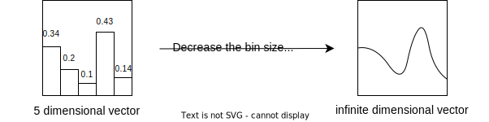

# Automatic Functional Differentiation in JAX

**TLDR:** We implemented automatic **functional differentiation** (as in variational calculus) in JAX, one can do `g=jax.grad(F)(f)` to get the derivative of the functional `F` at function `f`, where `g` is itself a callable python function.

## Installation and Usage

Autofd can be installed via pip

``` shell
pip install autofd
```

A minimal example on how to use this package.

``` python
import jax
import jax.numpy as jnp
from jaxtyping import Float32, Array
from autofd import function
import autofd.operators as o

# define a function
@function
def f(x: Float32[Array, ""]) -> Float32[Array, ""]:
  return -x**2

# define a functional
def F(f):
  return o.integrate(o.compose(jnp.exp, f))

# take the functional derivative
dFdf = jax.grad(F)(f)

# dFdf is invokable!
dFdf(1.)
```

## Background

### Function generalizes vector

In mathematics, we can see functions as generalizations of vectors. In layman's terms, we can see a vector as a list of bins with different height, e.g. `v=[0.34, 0.2, 0.1, 0.43, 0.14]`. This list can be indexed using integers, `v[2]` is `0.1`. If we decrease the size of each bin while we increase the number of bins to infinity, eventually we obtain an infinite dimensional vector that can be continuously indexed. In this case when we use $v(x)$ to denote we take the element at position $x$. We can call this infinite dimensional vector a **function** and taking the element at $x$ becomes a function call.



As we see functions as infinite dimensional vectors, the manipulations that we apply on vectors can also be generalized. For example, 

- Summation becomes integration: $\sum_i v_i \rightarrow \int v(x) dx$.
- Difference becomes differentiation: $v[i]-v[i-1] \rightarrow \nabla v(x)$.
- Linear operation: $u_j=\sum_{i}w_{ji}v_i \rightarrow u(y)=\int w(y,x)v(x)dx$.

### Function of functions

In JAX, we can easily write python functions that process `Array`s that represent vectors or tensors. With the above generalizations, we can also write functions that process infinite dimensional arrays (functions), which we call **function of functions**, or **higher-order** functions. There are many higher-order functions in JAX, for example, `jax.linearize`, `jax.grad`, `jax.vjp` etc. Even in pure python, higher-order functions are very common, the decorator pattern in python is implemented via higher-order functions.

### Operators and functionals

Functions of functions has many names, generally we call them higher-order functions. Specifically, when the higher-order function maps a function to another function, it is often called an **operator**, e.g. $\nabla$ is an operator. When the higher-order function maps a function to a scalar, it is often called a **functional**, e.g. $f\mapsto \int f(x) dx$ is a functional. Conventionally, we use upper-case for higher-order functions, and lower-case for normal functions, like we invoke a function $f$ with input $x$ by $f(x)$, $F(f)$ means we invoke the higher-order function $F$ with input $f$ (In some contexts, square braket like $F[f]$ is used to further denote we're invoking a functional).

### Functional derivatives and variational calculus

Just like we can compute the derivative of a function $f$ at a point $x$ by $\frac{df}{dx}$, we can compute the derivative of a functional too. It is denoted as $\frac{\delta F}{\delta f}$. In machine learning we use the derivative information to perform gradient descent, which helps us find the $x$ that minimizes the function $f$. Similarly, we could also use the functional derivative to perform gradient descent for the functional, which gives us the $f$ that minimizes $F$. This procedure is called the [calculus of variation](https://en.wikipedia.org/wiki/Calculus_of_variations).

## Technical Details

Please see the paper []() (to be added).
